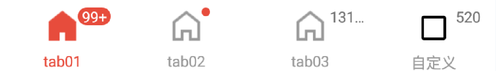
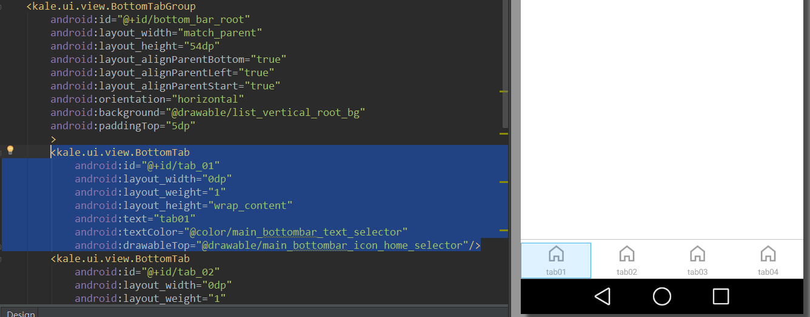

# BottomTabBar
底部tab切换栏。完全模仿了RadioGroup的机制，提供了可以扩展的接口  
   
`BottomTabGroup`完全模仿了RadioGroup的机制，你可以理解为它是`RadioGroup`的增强版本，它内部的view不再仅限于`RadioButton`了，而是实现了`BottomTabImpl`这个接口的的任何view。这样我们可以很容易的用自定义控件来做类似RadioButton的效果了，自然而然就能有更多的扩展性。  

### 如何使用  
--   
```
repositories {
	    maven {
	        url "https://jitpack.io"
	    }
	}
```  
```  
	dependencies {
	        compile 'com.github.tianzhijiexian:BottomTabBar:1.0.1'
	}
```  
	
在项目中已经有一个`BottomTabImpl`的实现类——`BottomTab`，我们可以利用它来轻松实现底部的tab栏。当然你可以根据需要自定义一个view，实现的方式参考`BottomTab`就可以了。下面我们来看看如何写布局吧~  

1.首先在布局中像放RadioGroup时放一个BottomTabGroup:  

```xml
 	<kale.ui.view.BottomTabGroup
        android:layout_width="match_parent"
        android:layout_height="54dp"
        >
        
        
    </kale.ui.view.BottomTabGroup>  
```  
  
2.然后在里面像放RadioButton一样放入BottomTab:  
```xml  
 <kale.ui.view.BottomTabGroup
        android:id="@+id/bottom_bar_root"
        android:layout_width="match_parent"
        android:layout_height="54dp"
        android:layout_alignParentBottom="true"
        android:layout_alignParentLeft="true"
        android:layout_alignParentStart="true"
        android:orientation="horizontal"
        android:background="@drawable/list_vertical_root_bg"
        android:paddingTop="5dp"
        >
        <kale.ui.view.BottomTab
            android:id="@+id/tab_01"
            android:layout_width="0dp"
            android:layout_weight="1"
            android:layout_height="wrap_content"
            android:text="tab01"
            android:textColor="@color/main_bottombar_text_selector"
            android:drawableTop="@drawable/main_bottombar_icon_home_selector"/>
        <kale.ui.view.BottomTab
            android:id="@+id/tab_02"
            android:layout_width="0dp"
            android:layout_weight="1"
            android:layout_height="wrap_content"
            android:text="tab02"
            android:textColor="@color/main_bottombar_text_selector"
            android:drawableTop="@drawable/main_bottombar_icon_home_selector"/>
        
        <kale.ui.view.BottomTab
            android:id="@+id/tab_03"
            android:layout_width="0dp"
            android:layout_weight="1"
            android:layout_height="wrap_content"
            android:text="tab03"
            android:textColor="@color/main_bottombar_text_selector"
            android:drawableTop="@drawable/main_bottombar_icon_home_selector"/>
        
        <kale.ui.view.BottomTab
            android:id="@+id/tab_04"
            android:layout_width="0dp"
            android:layout_weight="1"
            android:layout_height="wrap_content"
            android:text="tab04"
            android:textColor="@color/main_bottombar_text_selector"
            android:drawableTop="@drawable/main_bottombar_icon_home_selector"/>
        
    </kale.ui.view.BottomTabGroup>  
```  
这样就搞定啦~  
   


### 设置属性    
--  
如果你用的是包中提供的BottomTab的话，那么你有下面这几个属性可以设置：  

1.通过xml：  
`android:text`：设置按钮下方的文字  
`android:textColor`：设置按钮的颜色  
`android:drawableTop`：设置按钮中的图片    

2.通过java代码：  
```JAVA    
BottomTab tab01 = (BottomTab) root.getChildAt(0);
        tab01.getHint().setBackgroundResource(R.drawable.red_hint); // 设置提示红点的背景
        tab01.setHint("99+"); // 设置提示红点上的文字
        tab01.getHint().setTextColor(0xffffffff); // 设置提示红点上文字的颜色  

BottomTab tab04 = (BottomTab) root.getChildAt(3);
        tab04.setTabDrawable(R.drawable.abc_btn_check_material) // 设置按钮的图片
        .setTabText("自定义") // 设置按钮下面的文字
        .setHint(520); // 设置提示红点部分的文字  
```    
其中`getHint()`就是得到的textView这个对象，所以想怎么设置就怎么设置。`getTabButton()`得到的是按钮主体的对象（内部是一个RadioButton），对外是一个TextView。  

### 扩展    
--  
前面说到了BottomTab就是一个具体的实现类，我们完全可以用自定义View的方式来做出自己的按钮和红点来，下面推荐两种实现方式，可以按需求来做。  
1.继承BottomTab**（简单）**   
继承BottomTab这个类，然后复写`getLayoutRes()`这个方法，传入你自定义的一个layout的id:  
```JAVA  
public class TestView extends BottomTab{


    public TestView(Context context, AttributeSet attrs) {
        super(context, attrs);
    }
    
    public TestView(Context context, AttributeSet attrs, int defStyle) {
        super(context, attrs, defStyle);
    }

    @Override
    public int getLayoutRes() {
        return R.layout.test_main;
    }
}  
```  
在这个layout中你必须要放入一个id为：tab_btn和tab_hint的两个View，其中一个是RadioButton，一个是TextView。这样id为tab_hint的TextView就可以做红点提示，而id为tab_btn的RadioButton就可以做实体的按钮了。需要注意的是BottomTab这个view是继承自RelativeLayout的，所以在做布局的时候需要注意下控件摆放的位置。为了减少布局的层次，你还可以用merge标签。就像下面的写法：  
```xml  
<merge xmlns:android="http://schemas.android.com/apk/res/android"
    xmlns:tools="http://schemas.android.com/tools"
    >
 
    <RadioButton
        android:id="@+id/tab_btn"
        android:layout_width="wrap_content"
        android:layout_height="match_parent"
        android:layout_centerHorizontal="true"
        android:button="@null"
        android:drawablePadding="1dp"
        android:gravity="center"
        android:textSize="11sp"
        />

    <TextView
        android:id="@+id/tab_hint"
        android:layout_width="wrap_content"
        android:layout_height="wrap_content"
        android:layout_centerHorizontal="true"
        android:paddingLeft="4dp"
        android:paddingRight="4dp"
        android:layout_toRightOf="@+id/tab_btn"
        android:layout_marginLeft="-5dp"
        android:textSize="11sp"
        android:minHeight="6dp"
        android:singleLine="true"
        
        />

</merge>
```
  
2.实现BottomTabImpl**（扩展性强）**    
自定义一个view实现BottomTabImpl这个接口，然后请模仿BottomTab的写法进行编写。这样的方式是需要重新编写一些按钮点击事件，但是扩展性是最强的。

### 开发者


Jack Tony: <developer_kale@.com>  


### License

    Copyright 2015 Jack Tony

    Licensed under the Apache License, Version 2.0 (the "License");
    you may not use this file except in compliance with the License.
    You may obtain a copy of the License at

       http://www.apache.org/licenses/LICENSE-2.0

    Unless required by applicable law or agreed to in writing, software
    distributed under the License is distributed on an "AS IS" BASIS,
    WITHOUT WARRANTIES OR CONDITIONS OF ANY KIND, either express or implied.
    See the License for the specific language governing permissions and
    limitations under the License.

 
